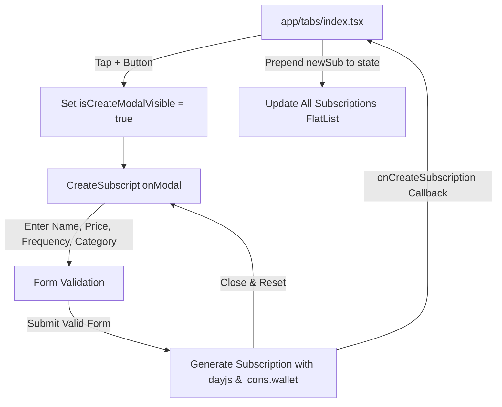

# Requirements

### Overview & Goals
The goal is to implement a new subscription creation modal (`CreateSubscriptionModal`) in the React Native application and integrate it with the Home Screen (`app/(tabs)/index.tsx`). When users tap the "+" add button in the header, the modal will slide up from the bottom, allowing users to enter subscription details (Name, Price, Frequency, and Category) with live validation, date calculations via `dayjs`, and styling conforming to the design system defined in `global.css`. Submitting the form prepends the new subscription to the active list on the Home Screen.

### Scope
- **In Scope:**
  - Create `components/CreateSubscriptionModal.tsx` as a sliding bottom modal with transparent overlay.
  - Header containing the "New Subscription" title and dismiss/close button.
  - Four form controls:
    1. **Name**: `TextInput` with `auth-input` class.
    2. **Price**: `TextInput` (`keyboardType="decimal-pad"`) with `auth-input` class.
    3. **Frequency**: Toggle buttons for "Monthly" and "Yearly" with `picker-option` / `picker-option-active` classes.
    4. **Category**: Selectable chip list covering 8 categories (Entertainment, AI Tools, Developer Tools, Design, Productivity, Cloud, Music, Other) with `category-chip` / `category-chip-active` classes.
  - Submit button using `auth-button` / `auth-button-disabled` styling, enabled only when name is non-empty and price is a valid positive number.
  - Auto-generate subscription properties: unique `id`, `status: "active"`, `startDate` (now), `renewalDate` (calculated via `dayjs` based on frequency), `icon: icons.wallet`, `billing: frequency`, and category-based card background color.
  - Wrap in `KeyboardAvoidingView` on iOS.
  - Reset form fields and close modal on successful submit.
  - Update `app/(tabs)/index.tsx` to wrap the `icons.add` header icon in a `Pressable` that opens the modal and prepends created subscriptions to the list.
- **Out of Scope:**
  - Backend API persistence or database writes (subscriptions are stored in React component state).
  - Installing new third-party packages (only use existing `clsx`, `dayjs`, `@expo/vector-icons`, and React Native components).

### User Stories
- **As a user**, I want to tap the "+" button on the home screen so that I can quickly open a modal to add a new subscription.
- **As a user**, I want to enter subscription name, price, billing frequency, and category chips so that I can categorize and track my spending.
- **As a user**, I want the submit button to only be active when I have entered valid information so that invalid or empty subscriptions cannot be added.
- **As a user**, I want the newly added subscription to immediately appear at the top of my subscriptions list with the correct renewal date and category styling.

### Functional Requirements
- **FR-1: Modal Structure & Animation**: The modal must use React Native's `<Modal>` with `animationType="slide"` and `transparent={true}`, rendering a semi-transparent dark overlay (`modal-overlay`) and a bottom container (`modal-container`).
- **FR-2: Header**: Display a top header with title "New Subscription" (`modal-title`) and a close button (`modal-close`) that dismisses the modal and resets inputs.
- **FR-3: Form Inputs**:
  - Name input (`TextInput`, `auth-input`, auto-capitalization).
  - Price input (`TextInput`, `keyboardType="decimal-pad"`, `auth-input`).
  - Frequency toggle (`Monthly` | `Yearly`) using `picker-row` and `picker-option` / `picker-option-active`.
  - Category chips using `category-scroll` and `category-chip` / `category-chip-active` for: `Entertainment`, `AI Tools`, `Developer Tools`, `Design`, `Productivity`, `Cloud`, `Music`, `Other`.
- **FR-4: Validation**:
  - Name must be trimmed and non-empty (`name.trim().length > 0`).
  - Price must parse to a number strictly greater than 0 (`!isNaN(price) && Number(price) > 0`).
  - Submit button is disabled and styled with `auth-button-disabled` when invalid.
- **FR-5: Subscription Generation**:
  - `id`: unique generated string (e.g., `sub-${Date.now()}`).
  - `startDate`: current date ISO string (`dayjs().toISOString()`).
  - `renewalDate`: calculated 1 month ahead for Monthly or 1 year ahead for Yearly (`dayjs().add(1, 'month').toISOString()` / `dayjs().add(1, 'year').toISOString()`).
  - `icon`: `icons.wallet`.
  - `status`: `"active"`.
  - `billing`: current selected frequency (`"Monthly"` | `"Yearly"`).
  - `color`: mapped based on selected category.
- **FR-6: Home Screen Integration**:
  - In `app/(tabs)/index.tsx`, the `icons.add` header icon is wrapped in a `Pressable` with accessibility label and tap handler.
  - Created subscription is prepended to the `subscriptions` state array (`setSubscriptions(prev => [newSub, ...prev])`).

### Non-Functional Requirements
- **Performance & Rendering**: Avoid unnecessary re-renders; utilize memoized handlers and `clsx` for dynamic Tailwind classes.
- **Platform Handling**: Use `KeyboardAvoidingView` with `Platform.OS === 'ios' ? 'padding' : undefined` for smooth mobile keyboard interactions.
- **Design System Consistency**: Fully leverage existing classes in `global.css` (`modal-*`, `picker-*`, `category-*`, `auth-*`).

# Technical Design

### Current Implementation
- `app/(tabs)/index.tsx`: Contains the Home Screen with `subscriptions` state initialized from `HOME_SUBSCRIPTIONS`. The header renders `<Image source={icons.add} className="home-add-icon" />` as a static image without an `onPress` wrapper.
- `global.css`: Contains complete class definitions for modals (`modal-overlay`, `modal-container`, `modal-header`, `modal-title`, `modal-close`, `modal-close-text`, `modal-body`), pickers (`picker-row`, `picker-option`, `picker-option-active`, `picker-option-text`, `picker-option-text-active`), category chips (`category-scroll`, `category-chip`, `category-chip-active`, `category-chip-text`, `category-chip-text-active`), and auth inputs/buttons (`auth-field`, `auth-label`, `auth-input`, `auth-button`, `auth-button-disabled`, `auth-button-text`).
- `constants/icons.ts`: Exports `icons.wallet` and `icons.add`.
- `type.d.ts`: Defines the `Subscription` interface with properties: `id`, `icon`, `name`, `plan`, `category`, `paymentMethod`, `status`, `startDate`, `price`, `currency`, `billing`, `renewalDate`, `color`.

### Key Decisions
1. **Component Placement**: Create `components/CreateSubscriptionModal.tsx` directly in `components/` to match the project's folder convention and path alias `@/*`.
2. **Date Computation**: Use the pre-installed `dayjs` library to calculate `startDate` and `renewalDate` based on the selected frequency (`Monthly` -> `dayjs().add(1, 'month')`, `Yearly` -> `dayjs().add(1, 'year')`).
3. **Category Color Palette**: Map the 8 categories to harmonized pastel tones matching existing subscriptions (`#ffd6a5`, `#b8d4e3`, `#e8def8`, `#f5c542`, `#b8e8d0`, `#caffbf`, `#9bf6ff`, `#e2e8f0`).
4. **Form State Management**: Manage local component state for `name`, `price`, `frequency`, and `category`, resetting them to default values upon closing or successful submission.

### Architecture Diagram


### Proposed Changes

#### 1. `components/CreateSubscriptionModal.tsx`
Create a new component with the following signature and implementation:
```typescript
interface CreateSubscriptionModalProps {
  visible: boolean;
  onClose: () => void;
  onCreateSubscription: (subscription: Subscription) => void;
}
```
- Local state:
  - `name`: string (default `""`)
  - `price`: string (default `""`)
  - `frequency`: `"Monthly"` | `"Yearly"` (default `"Monthly"`)
  - `category`: string (default `"Entertainment"`)
- Validation:
  - `isValid = name.trim().length > 0 && !isNaN(parseFloat(price)) && parseFloat(price) > 0`
- Category List:
  - `["Entertainment", "AI Tools", "Developer Tools", "Design", "Productivity", "Cloud", "Music", "Other"]`
- Category Colors:
  - `Entertainment`: `#ffd6a5`
  - `AI Tools`: `#b8d4e3`
  - `Developer Tools`: `#e8def8`
  - `Design`: `#f5c542`
  - `Productivity`: `#b8e8d0`
  - `Cloud`: `#caffbf`
  - `Music`: `#9bf6ff`
  - `Other`: `#e2e8f0`
- Layout:
  - `<Modal visible={visible} transparent animationType="slide" onRequestClose={handleClose}>`
  - `<KeyboardAvoidingView behavior={Platform.OS === "ios" ? "padding" : undefined} className="flex-1">`
  - `<Pressable className="modal-overlay justify-end" onPress={handleClose}>`
    - `<Pressable className="modal-container" onPress={(e) => e.stopPropagation()}>`
      - Header: title "New Subscription", close button `✕`
      - ScrollView / Body:
        - Name input field (`auth-field`, `auth-label`, `auth-input`)
        - Price input field (`auth-field`, `auth-label`, `auth-input`, `keyboardType="decimal-pad"`)
        - Frequency picker (`picker-row`, `picker-option` with `clsx` for active state)
        - Category chips (`category-scroll`, `category-chip` with `clsx` for active state)
        - Submit button (`auth-button`, disabled styling with `auth-button-disabled`, text `Add Subscription`)

#### 2. `app/(tabs)/index.tsx`
- Import `CreateSubscriptionModal` from `@/components/CreateSubscriptionModal`.
- Add `const [isCreateModalVisible, setIsCreateModalVisible] = useState(false)`.
- Wrap `<Image source={icons.add} className="home-add-icon" />` with a `Pressable` with `onPress={() => setIsCreateModalVisible(true)}`.
- Add `handleCreateSubscription`:
  ```typescript
  const handleCreateSubscription = (newSub: Subscription) => {
    setSubscriptions((prev) => [newSub, ...prev]);
  };
  ```
- Render `<CreateSubscriptionModal visible={isCreateModalVisible} onClose={() => setIsCreateModalVisible(false)} onCreateSubscription={handleCreateSubscription} />` within the screen container.

### Data Models & Contracts
```typescript
export interface Subscription {
  id: string;
  icon: ImageSourcePropType;
  name: string;
  plan?: string;
  category?: string;
  paymentMethod?: string;
  status?: string;
  startDate?: string;
  price: number;
  currency?: string;
  billing: string;
  renewalDate?: string;
  color?: string;
}
```

### File Structure Changes
- **New File**: `components/CreateSubscriptionModal.tsx`
- **Modified File**: `app/(tabs)/index.tsx`

# Testing

### Validation Approach
Verification will be performed by reviewing component props, styling classes, state lifecycles, and user interactions on the Home Screen.

### Key Scenarios
1. **Modal Presentation and Dismissal**:
   - Tapping the "+" icon in the Home Screen header opens the modal with a slide animation.
   - Tapping the close button `✕` or overlay dismisses the modal without adding any subscription.
2. **Form Input and Validation**:
   - Submit button remains disabled when name is empty or price is 0 / empty / negative.
   - Submit button enables as soon as a valid name (e.g. "ChatGPT Plus") and a valid positive price (e.g. "20") are entered.
3. **Toggle and Chip Selection**:
   - Switching between "Monthly" and "Yearly" updates the selected frequency and active styling.
   - Selecting a category chip updates the active chip styling and associated color.
4. **Subscription Creation and Date Calculation**:
   - Submitting a Monthly subscription creates a subscription with `renewalDate` 1 month from now and `billing: "Monthly"`.
   - Submitting a Yearly subscription creates a subscription with `renewalDate` 1 year from now and `billing: "Yearly"`.
   - The new item is prepended to the `subscriptions` state array and immediately appears as the first card in the "All Subscriptions" list with `icons.wallet` and category color.
   - Form fields reset to defaults upon successful creation.

### Edge Cases
- **Non-numeric / malformed price input**: Verify price parsing rejects trailing dots or invalid strings like `"abc"`.
- **Keyboard avoidance on iOS**: Verify `KeyboardAvoidingView` prevents the keyboard from obscuring input fields and the submit button.
- **Whitespace-only names**: Verify `name.trim().length === 0` is treated as invalid and disables the submit button.

# Delivery Steps

### ✓ Step 1: Implement CreateSubscriptionModal component
Create the `components/CreateSubscriptionModal.tsx` modal component with sliding animation, transparent overlay, form fields, and submission logic.

- Create `components/CreateSubscriptionModal.tsx` exporting `CreateSubscriptionModal`.
- Wrap the content in `Modal` (`animationType="slide"`, `transparent`), `KeyboardAvoidingView` (with `Platform.OS === 'ios' ? 'padding' : undefined`), and overlay/container views styled with `modal-overlay` and `modal-container`.
- Implement the header with "New Subscription" title and close button using `modal-header`, `modal-title`, and `modal-close`.
- Implement four form fields:
  - Name: `TextInput` with `auth-input` styling and placeholder.
  - Price: `TextInput` with `keyboardType="decimal-pad"` and `auth-input` styling.
  - Frequency: Toggle options for "Monthly" and "Yearly" using `picker-row`, `picker-option`, `picker-option-active`, `picker-option-text`, and `picker-option-text-active`.
  - Category: Chips for Entertainment, AI Tools, Developer Tools, Design, Productivity, Cloud, Music, and Other using `category-scroll`, `category-chip`, `category-chip-active`, `category-chip-text`, and `category-chip-text-active`.
- Implement validation logic to ensure name is non-empty and price is a valid positive number, toggling `auth-button` and `auth-button-disabled` styling on the submit button.
- Map categories to colors and construct the new `Subscription` object with calculated dates (`dayjs`) and `icons.wallet` icon.
- Implement form reset and modal dismissal upon submission or cancellation.

### ✓ Step 2: Hook up modal to Home Screen header and subscription list
Integrate `CreateSubscriptionModal` into `app/(tabs)/index.tsx` so tapping the "+" icon opens the modal and newly created subscriptions prepend to the home screen list.

- Import `CreateSubscriptionModal` in `app/(tabs)/index.tsx`.
- Add `isCreateModalVisible` state boolean.
- Wrap the header "+" icon (`icons.add`) in a `Pressable` / `TouchableOpacity` to open the modal on press.
- Implement `handleCreateSubscription` handler that prepends the new subscription item to the existing `subscriptions` state array.
- Render `CreateSubscriptionModal` at the bottom of the screen layout with appropriate `visible`, `onClose`, and `onCreateSubscription` props.
- Verify that the subscription immediately appears at the top of the "All Subscriptions" `FlatList` and is interactive.