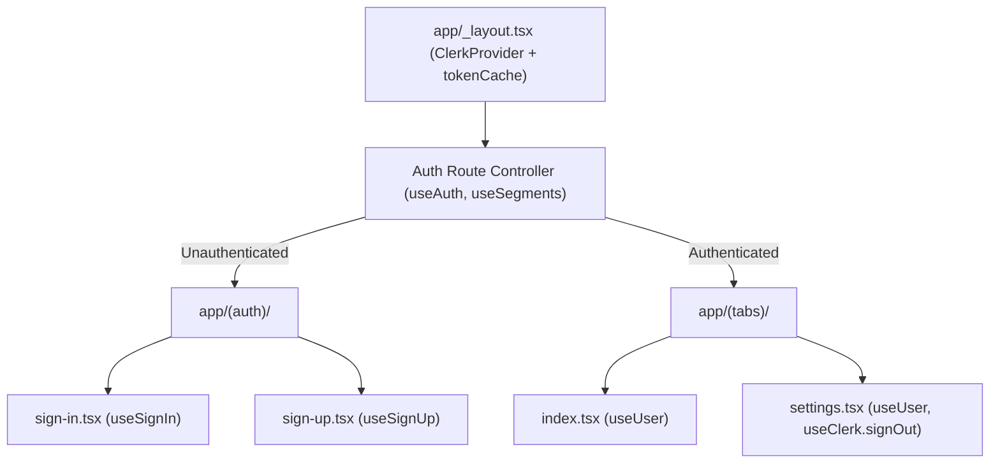

# Requirements

### Overview & Goals
Integrate Clerk authentication into the Expo React Native application using `@clerk/expo` with custom branded UI screens, secure token storage via `expo-secure-store`, full sign-up with email verification, sign-in flow, route guards, and authenticated user profile integration.

### Scope
- **In Scope:**
  - Setup `<ClerkProvider>` with `tokenCache` in `app/_layout.tsx`.
  - Custom Sign-In screen in `app/(auth)/sign-in.tsx` matching project styling in `global.css`.
  - Custom Sign-Up screen with email OTP verification flow in `app/(auth)/sign-up.tsx`.
  - Route protection / auth guards navigating users based on `isSignedIn` and `isLoaded` state.
  - User session display (name, avatar, email) in `app/(tabs)/index.tsx` and `app/(tabs)/settings.tsx`.
  - Sign-out functionality in `app/(tabs)/settings.tsx`.
- **Out of Scope:**
  - Native OAuth credentials (Google/Apple) requiring native dev builds and external developer console setup (can be added later).
  - Backend webhook processing / database sync.

### User Stories
- As a new user, I want to sign up with my email and password and verify my account via code so that I can securely manage my subscriptions.
- As a returning user, I want to sign in with my email and password so that I can access my saved subscription data.
- As an authenticated user, I want to see my profile info on the Home screen and Settings screen, and have the ability to sign out anytime.
- As an unauthenticated visitor, I want to be redirected to the sign-in screen when opening the app.

### Functional Requirements
- **FR-1:** Wrap the root layout with `<ClerkProvider>` using `tokenCache` backed by `expo-secure-store` and `EXPO_PUBLIC_CLERK_PUBLISHABLE_KEY`.
- **FR-2:** Implement custom sign-in screen with email and password inputs, form validation, error message display, and loading indicator.
- **FR-3:** Implement custom sign-up screen with email and password inputs, verification code state, OTP submission, and session finalization.
- **FR-4:** Protect `(tabs)` routes so that unauthenticated users are redirected to `/(auth)/sign-in`.
- **FR-5:** Redirect authenticated users away from `(auth)` screens to `/(tabs)`.
- **FR-6:** Replace static `HOME_USER` placeholders in `app/(tabs)/index.tsx` and `app/(tabs)/settings.tsx` with Clerk's `useUser()` hook data.
- **FR-7:** Provide a Sign Out action in `app/(tabs)/settings.tsx` that clears session state and routes to `/(auth)/sign-in`.

### Non-Functional Requirements
- **Security:** Tokens must be stored securely using `expo-secure-store` via `@clerk/expo/token-cache`.
- **UX & Design:** Form controls, buttons, and typography must utilize existing Tailwind / NativeWind utility classes from `global.css`.
- **Performance:** Smooth transitions without layout flickering during auth state hydration.

# Technical Design

### Current Implementation
- `package.json` already contains `@clerk/expo` (`^4.6.5`) and `expo-secure-store` (`~15.0.8`).
- `app.json` includes `@clerk/expo` and `expo-secure-store` plugins.
- `.env` contains `EXPO_PUBLIC_CLERK_PUBLISHABLE_KEY`.
- `global.css` contains pre-defined styling classes for auth screens (`.auth-safe-area`, `.auth-brand-block`, `.auth-card`, `.auth-input`, `.auth-button`, `.auth-link`, etc.).
- `app/_layout.tsx` currently only manages font loading and renders a plain `<Stack />` without `<ClerkProvider>`.
- `app/(auth)/sign-in.tsx` and `app/(auth)/sign-on.tsx` are empty placeholders.
- `app/(tabs)/index.tsx` uses static mock data `HOME_USER` from `@/constants/data`.

### Key Decisions
- **Custom Flow over Hosted/Native Components:** Use custom React Native UI flow with `@clerk/expo` hooks (`useSignIn`, `useSignUp`, `useAuth`, `useUser`, `useClerk`). This preserves full UI customization with the existing theme classes in `global.css` and works seamlessly in Expo Go without requiring native dev builds.
- **Standardized Route Naming:** Rename `app/(auth)/sign-on.tsx` to `app/(auth)/sign-up.tsx` for consistency with Expo Router conventions and Clerk documentation.
- **Centralized Route Protection:** Implement auth redirection inside a dedicated layout or hook observing `isLoaded`, `isSignedIn`, and route segments via `useSegments()` from `expo-router`.

### Architecture Diagram


### Proposed Changes
1. **Root Layout (`app/_layout.tsx`):**
   - Import `ClerkProvider` and `tokenCache` from `@clerk/expo/token-cache`.
   - Wrap tree with `<ClerkProvider publishableKey={publishableKey} tokenCache={tokenCache}>`.
   - Add auth navigation listener using `useAuth` and `useSegments` from `expo-router` to redirect between `(auth)` and `(tabs)`.

2. **Sign-In Screen (`app/(auth)/sign-in.tsx`):**
   - Implement custom email/password sign-in with `signIn.create({ identifier, password })`.
   - Set active session on success via `setActive({ session: result.createdSessionId })`.
   - Handle and display errors (e.g., invalid credentials).
   - Render link to `/(auth)/sign-up`.

3. **Sign-Up Screen (`app/(auth)/sign-up.tsx`):**
   - Implement registration form with `signUp.create({ emailAddress, password })` and `signUp.prepareEmailAddressVerification()`.
   - Implement OTP verification step with `signUp.attemptEmailAddressVerification({ code })` and `setActive({ session: result.createdSessionId })`.
   - Handle and display errors (e.g., password criteria, incorrect code).
   - Render link back to `/(auth)/sign-in`.

4. **Home Screen (`app/(tabs)/index.tsx`):**
   - Use `useUser()` hook to retrieve `user.fullName` or `user.primaryEmailAddress`.
   - Fall back to avatar image or `user.imageUrl`.

5. **Settings Screen (`app/(tabs)/settings.tsx`):**
   - Display active user profile details (name, email, creation date).
   - Implement Sign Out button triggering `useClerk().signOut()`.

### File Structure
```
app/
├── (auth)/
│   ├── _layout.tsx       # Auth stack layout
│   ├── sign-in.tsx       # Custom sign-in screen
│   └── sign-up.tsx       # Custom sign-up & OTP verification screen
├── (tabs)/
│   ├── _layout.tsx       # Tab bar layout
│   ├── index.tsx         # Home screen with user header
│   ├── settings.tsx      # Settings screen with user profile & sign-out
│   ├── insights.tsx      # Insights screen
│   └── subscriptions.tsx # Subscriptions screen
├── _layout.tsx           # Root layout with ClerkProvider & route guards
└── subscriptions/
    └── [id].tsx          # Subscription detail screen
```

### Risks & Mitigations
- **Hydration flicker:** While Clerk resolves `isLoaded`, render a loading screen or keep `SplashScreen` visible to prevent flickering between auth and main tabs.
- **Expired/Invalid Session:** Handle session expiry gracefully by catching auth hook errors and falling back to the sign-in screen.

# Testing

### Validation Approach
Verify authentication flows, state persistence, route protection, and UI integration using interactive inspection and simulated flows.

### Key Scenarios
- **Initial App Launch (Unauthenticated):**
  - Verify that opening the app redirects unauthenticated users to `/(auth)/sign-in`.
- **Sign-Up Flow:**
  - Enter email and password -> verify OTP verification screen appears.
  - Enter valid OTP code -> verify session activates and routes to `/(tabs)`.
- **Sign-In Flow:**
  - Enter valid credentials -> verify session activates and routes to `/(tabs)`.
  - Enter invalid credentials -> verify clear inline error message appears without crashing.
- **Session Persistence:**
  - Close and restart app -> verify user remains signed in without re-authenticating (token stored in SecureStore).
- **Home & Settings Integration:**
  - Verify authenticated user's name and image display in Home header and Settings screen.
- **Sign-Out Flow:**
  - Tap "Sign Out" in Settings -> verify session terminates and user is redirected to `/(auth)/sign-in`.

### Edge Cases
- Empty email or password submission.
- Malformed email address.
- Invalid or expired email verification code.
- Resending verification code when expired.
- Accessing deep links while unauthenticated.

# Delivery Steps

### ✓ Step 1: Configure ClerkProvider and Secure Token Cache in Root Layout
The root application layout initializes Clerk with secure token caching and exposes auth context to all screens.

- Import `ClerkProvider` from `@clerk/expo` and `tokenCache` from `@clerk/expo/token-cache` in `app/_layout.tsx`.
- Retrieve `EXPO_PUBLIC_CLERK_PUBLISHABLE_KEY` from the environment and validate presence with clear error messaging.
- Wrap the root `Stack` with `<ClerkProvider publishableKey={publishableKey} tokenCache={tokenCache}>`.
- Coordinate splash screen hiding (`SplashScreen.hideAsync()`) and font loading state with Clerk initial load state.

### ✓ Step 2: Implement Custom Sign-In Flow
Users can authenticate with email and password, see clear validation errors, and navigate to registration.

- Implement the sign-in screen in `app/(auth)/sign-in.tsx` using `useSignIn()` from `@clerk/expo` and `useRouter()` from `expo-router`.
- Apply custom design classes from `global.css` (`.auth-safe-area`, `.auth-card`, `.auth-input`, `.auth-button`, `.auth-link`).
- Add form states for email address, password, loading indicator, and structured error messages.
- Add navigation link to redirect users to the registration screen.

### ✓ Step 3: Implement Custom Sign-Up and Email Verification Flow
Users can register a new account, receive an email verification code, verify their email, and automatically activate their session.

- Implement registration in `app/(auth)/sign-up.tsx` (renaming or replacing `app/(auth)/sign-on.tsx`) using `useSignUp()` from `@clerk/expo`.
- Build the initial form state for email and password submission via `signUp.create()` / `signUp.password()`.
- Build the email verification step with numeric code input and `signUp.verifications.verifyEmailCode({ code })` and `signUp.finalize()`.
- Add `<View nativeID="clerk-captcha" />` for web/cross-platform support and render inline error feedback.
- Add navigation link to redirect users back to the sign-in screen.

### ✓ Step 4: Implement Auth Route Guards and Home User Context
Unauthenticated users are restricted to the auth group, and authenticated users are seamlessly directed to the main app tabs.

- Create an auth protection hook or routing controller in `app/_layout.tsx` or `app/(auth)/_layout.tsx` using `useAuth()` and `useSegments()`.
- Redirect unauthenticated users to `/(auth)/sign-in` when attempting to access `(tabs)` or `subscriptions/[id]`.
- Redirect authenticated users to `/(tabs)` when attempting to access `(auth)` routes.
- Update `app/(tabs)/index.tsx` to read the authenticated user's name and profile image dynamically using `useUser()` from `@clerk/expo`.

### ✓ Step 5: Implement User Profile Display and Sign-Out in Settings
Users can view their authenticated profile details and securely sign out from the settings screen.

- Update `app/(tabs)/settings.tsx` to display user profile information (full name, primary email address, profile picture) using `useUser()`.
- Add a sign-out button styled with `.sub-cancel` and `.sub-cancel-text` or `.auth-button`.
- Wire sign-out handler using `useClerk().signOut()`, navigating the user back to `/(auth)/sign-in`.