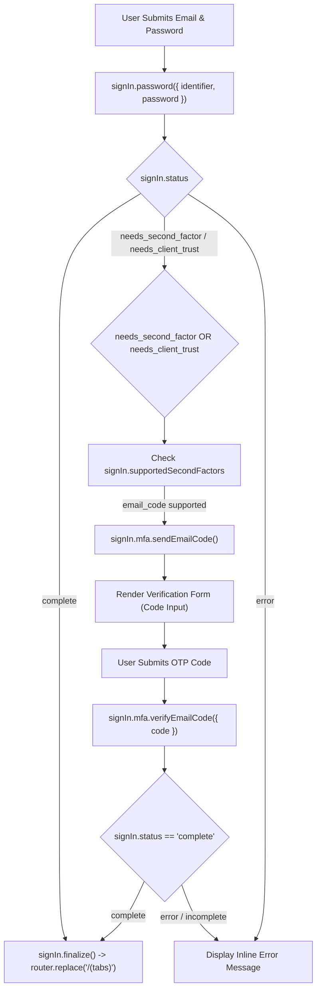

# Requirements

## Overview & Goals
Enhance the authentication sign-in flow in `app/(auth)/sign-in.tsx` to handle multi-factor authentication (`needs_second_factor`) and device trust challenges (`needs_client_trust`). When Clerk requires additional verification, the app will automatically select a supported factor (such as `email_code`) from `signIn.supportedSecondFactors`, initiate code transmission via `signIn.mfa.sendEmailCode()`, present a branded OTP entry screen reusing the verification UI from `app/(auth)/sign-up.tsx`, verify the code via `signIn.mfa.verifyEmailCode()`, and finalize the session with `signIn.finalize()`.

## Scope
- **In Scope:**
  - Update `onSignInPress` in `app/(auth)/sign-in.tsx` to inspect `signIn.status` for `needs_second_factor` and `needs_client_trust`.
  - Implement factor selection from `signIn.supportedSecondFactors` and code dispatch for `email_code` using `signIn.mfa.sendEmailCode()`.
  - Render an OTP code-entry UI in `app/(auth)/sign-in.tsx` matching the styling and UX of `app/(auth)/sign-up.tsx`.
  - Implement OTP code submission and verification via `signIn.mfa.verifyEmailCode({ code })`.
  - Handle session completion by calling `signIn.finalize()` and navigating to `/(tabs)`.
  - Add code resend functionality and "Back to Sign In" state reset with `signIn.reset()`.
  - Inline error handling for invalid credentials, code transmission failures, and verification errors.
- **Out of Scope:**
  - Changes to other auth screens (`sign-up.tsx`) or tab screens.
  - Adding third-party SMS or hardware authenticator SDKs not enabled in Clerk.

## User Stories
- As a user with multi-factor authentication enabled, I want to receive an email verification code when signing in with my password so that I can securely authenticate my identity.
- As a user signing in from an untrusted client or new device (`needs_client_trust`), I want the sign-in flow to prompt me for a verification code so that I can confirm my device.
- As a user awaiting a verification code, I want the option to resend the code if it did not arrive, or return to the password form if I need to change my credentials.

## Functional Requirements
- **FR-1:** After calling `signIn.password()`, check `signIn.status`. If `complete`, call `signIn.finalize()` and navigate to `/(tabs)` only after successful finalization without errors.
- **FR-2:** If `signIn.status` is `needs_second_factor` or `needs_client_trust`, inspect `signIn.supportedSecondFactors`. For `email_code`, invoke `signIn.mfa.sendEmailCode()`.
- **FR-3:** When verification is initiated, transition the screen into verification mode (`isVerifying = true`) displaying the code-entry form.
- **FR-4:** In verification mode, provide a numeric input for the OTP, a "Verify & Continue" button, a "Resend Code" button, and a "Back to Sign In" link that calls `signIn.reset()` and resets all verification state.
- **FR-5:** On code submission, invoke `signIn.mfa.verifyEmailCode({ code })`. Handle `{ error: verifyError }`, stop processing on error, and if `signIn.status` becomes `complete`, invoke `signIn.finalize()`, check `{ error: finalizeError }`, and redirect to `/(tabs)` upon success.
- **FR-6:** Provide inline feedback for resend operations via `signIn.mfa.sendEmailCode()`, handling `{ error: sendError }` and resetting `resending` in a `finally` block. Display error messages for failed verifications without crashing or unmounting the view.

## Non-Functional Requirements
- **UX Consistency:** The verification UI must share visual styling (`.auth-card`, `.auth-input`, `.auth-button`, `.auth-secondary-button`, `.auth-link`) with `sign-up.tsx`.
- **Reliability & Type Safety:** Clean asynchronous error handling around all Clerk SDK calls with full TypeScript safety.

# Technical Design

## Current Implementation
- In `app/(auth)/sign-in.tsx` (lines 40–74), `signIn.password()` is called.
- Lines 54–63 check `if (signIn.status === "complete")`:
  - If complete, it calls `signIn.finalize()` and navigates to `/(tabs)`.
  - Else, it immediately sets `setError("Sign in requires additional verification.")`, leaving the user stuck on the password screen without a way to provide their second factor or client trust code.

## Key Decisions
- **MFA & Client Trust State Management:** Introduce `isVerifying`, `code`, `resending`, and `resendMessage` state variables in `app/(auth)/sign-in.tsx`, mirroring the verified flow in `app/(auth)/sign-up.tsx`.
- **Automated Factor Initiation:** When `signIn.status === "needs_second_factor"` or `signIn.status === "needs_client_trust"`, check `signIn.supportedSecondFactors` (without inspecting `supportedFirstFactors`). If `email_code` is supported in that collection, invoke `await signIn.mfa.sendEmailCode()` and set `isVerifying(true)`.
- **Factor Verification & Finalization:** When the user enters the OTP and taps verify, invoke `const { error: verifyError } = await signIn.mfa.verifyEmailCode({ code: code.trim() })`. If `verifyError` occurs, display the error and stop processing. Once `signIn.status === "complete"`, call `const { error: finalizeError } = await signIn.finalize()`. If `finalizeError` occurs, display the error and stop processing; otherwise, navigate via `router.replace("/(tabs)")`.
- **Resend Handling with Proper Cleanup:** When resending the code, call `const { error: sendError } = await signIn.mfa.sendEmailCode()`. Stop and display the error if `sendError` occurs, show a success message otherwise, and ensure `resending` state is always reset in a `finally` block.
- **Reset on Back Navigation:** When navigating back to credential entry, call Clerk's `signIn.reset()` and reset all verification state variables (`code`, `error`, `resendMessage`, `isVerifying`, `resending`).
- **Fallback for Non-Email Strategies:** If the required second factor is not `email_code`, display a descriptive error indicating the required strategy.
- **Reusable Form Template:** Reuse the exact JSX structure from `app/(auth)/sign-up.tsx` lines 167–234 for the verification card layout.

## Architecture Diagram


## Proposed Changes
1. **State Extensions (`app/(auth)/sign-in.tsx`):**
   - Add state hooks:
     - `const [code, setCode] = useState("");`
     - `const [isVerifying, setIsVerifying] = useState(false);`
     - `const [resending, setResending] = useState(false);`
     - `const [resendMessage, setResendMessage] = useState("");`

2. **Sign-In Handler Update (`onSignInPress`):**
   - Check for `signIn.status === "needs_second_factor"` and `signIn.status === "needs_client_trust"`.
   - Use `signIn.supportedSecondFactors` to select `email_code` and initiate factor verification:
     ```ts
     const { error: sendError } = await signIn.mfa.sendEmailCode();
     if (sendError) {
       setError(sendError.message || "Failed to send verification code.");
       return;
     }
     setIsVerifying(true);
     ```

3. **Add Verification Handler (`onVerifyPress`):**
   - Validate `code.trim()`.
   - Call `const { error: verifyError } = await signIn.mfa.verifyEmailCode({ code: code.trim() })`.
   - If `verifyError`, display message and return.
   - If `signIn.status === "complete"`, call `const { error: finalizeError } = await signIn.finalize()`.
   - If `finalizeError`, display message and return.
   - Navigate via `router.replace("/(tabs)")` only after successful finalization.

4. **Add Resend Handler (`onResendCode`):**
   - Set `resending(true)`.
   - Call `const { error: sendError } = await signIn.mfa.sendEmailCode()`.
   - If `sendError`, display error message.
   - Else, display confirmation via `setResendMessage("Verification code resent to your email.")`.
   - In `finally` block, reset `setResending(false)`.

5. **UI Rendering & State Reset Updates:**
   - Update header block to dynamically show `"Verify Your Identity"` when `isVerifying` is true.
   - Conditionally render verification form (code `TextInput`, verify button, resend button, and back link) when `isVerifying` is true, or the email/password form when `isVerifying` is false.
   - On "Back to Sign In", invoke `signIn.reset()` and clear `code`, `error`, `resendMessage`, `isVerifying`, and `resending`.

## File Structure
```text
app/
└── (auth)/
    ├── sign-in.tsx  # Enhanced with MFA/client-trust factor selection & verification UI
    └── sign-up.tsx  # Reference code-entry UI layout
```

## Risks & Mitigations
- **Factor strategy mismatch:** If a user has authenticator app (TOTP) or SMS configured, check `signIn.supportedSecondFactors` and fall back with a clear error prompt if `email_code` is not available.
- **State reset on back navigation:** When the user taps "Back to Sign In", call Clerk's `signIn.reset()` and clear `code`, `error`, `resendMessage`, `isVerifying`, and `resending` so the user can re-enter credentials cleanly.

# Testing

## Validation Approach
Verify password submission, status routing (`complete` vs `needs_second_factor`/`needs_client_trust`), OTP transmission, verification, session finalization, error handling on failures, and TypeScript type correctness.

## Key Scenarios
- **Direct Sign-In (No 2FA/Trust needed):**
  - Enter credentials -> `signIn.password()` succeeds with status `complete` -> `signIn.finalize()` succeeds -> redirected to `/(tabs)`.
- **MFA Flow (Email Code):**
  - Enter credentials -> `signIn.status` returns `needs_second_factor` -> `sendEmailCode()` triggers -> UI transitions to code entry -> enter code -> `verifyEmailCode()` succeeds -> session finalized -> redirected to `/(tabs)`.
- **Client Trust Flow (Email Code):**
  - Enter credentials -> `signIn.status` returns `needs_client_trust` -> `sendEmailCode()` triggers -> UI transitions to code entry -> enter code -> verified and finalized.
- **Resend Code:**
  - On verification screen, tap "Resend Code" -> spinner appears -> success message displayed (or `sendError` handled) -> `resending` reset in finally block -> new code accepted.
- **Invalid Verification Code:**
  - Enter invalid code -> `verifyError` handled and displayed -> user remains on verification screen to retry.
- **Return to Sign-In:**
  - Tap "Back to Sign In" -> `signIn.reset()` called -> verification state (`code`, `error`, `resendMessage`, `isVerifying`, `resending`) resets -> user returns to email and password fields.

## Edge Cases
- Submitting empty verification code.
- Network error during `signIn.mfa.sendEmailCode()` or `signIn.mfa.verifyEmailCode()`.
- Expired verification code requiring resend.

# Delivery Steps

### ✓ Step 1: Implement MFA and Client Trust Factor Initiation Logic in SignInScreen
SignInScreen evaluates `signIn.status` on password submission and initiates factor verification for `needs_second_factor` and `needs_client_trust` challenges.

- Extend state in `app/(auth)/sign-in.tsx` with `isVerifying`, `code`, `resending`, and `resendMessage`.
- Inspect `signIn.status` after `signIn.password()` for `needs_second_factor` and `needs_client_trust`.
- Inspect `signIn.supportedSecondFactors` for `email_code` factor.
- Invoke `await signIn.mfa.sendEmailCode()` for email verification factor and set `isVerifying(true)`.
- Handle initiation errors and unsupported factors gracefully with descriptive inline error messages.

### ✓ Step 2: Implement Code Verification UI, Submission Handler, Resend Flow, and Session Finalization
Users entering MFA or client trust verification can input their OTP code, resend verification codes, verify their session, or return to the password screen.

- Add `onVerifyPress` handler to submit `code` via `signIn.mfa.verifyEmailCode({ code: code.trim() })`.
- Validate verification result and call `signIn.finalize()` upon status `complete`.
- Route to `/(tabs)` once session is active.
- Add `onResendCode` handler with `signIn.mfa.sendEmailCode()` and reset `resending` in a `finally` block.
- Add "Back to Sign In" navigation that calls `signIn.reset()` and resets all verification state.
- Render verification code input, submit button, resend button, and back link matching `sign-up.tsx` visual design.