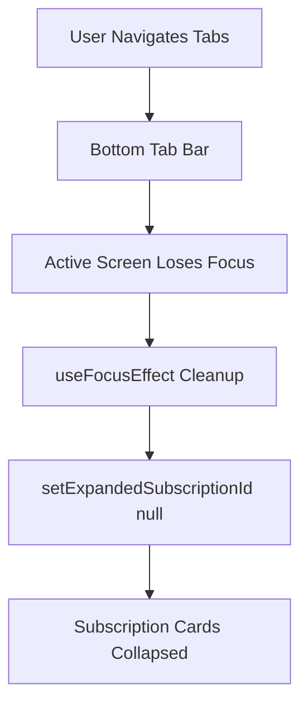

# Requirements

### Overview & Goals
Ensure that any expanded subscription card automatically closes (collapses) when the user navigates or switches between different tabs/menus in the application, returning the screens to a clean, uncluttered default state.

### Scope
- **In Scope**:
  - Automatically reset `expandedSubscriptionId` to `null` whenever the user switches away from or into the **Subscriptions** tab (`app/(tabs)/subscriptions.tsx`).
  - Automatically reset `expandedSubscriptionId` to `null` whenever the user switches away from or into the **Home** tab (`app/(tabs)/index.tsx`).
  - Integrate React Navigation / Expo Router focus hooks (`useFocusEffect` / `useCallback`) to reliably manage screen focus/blur lifecycle transitions.
- **Out of Scope**:
  - Modifying card expansion behavior during active interaction within the same screen.
  - Adding persistent global expand/collapse state.

### User Stories
- As a user, I want an expanded subscription card to automatically collapse when I switch tabs so that each menu screen starts in a clean and organized state whenever I return to it.
- As a user, I want navigation between Home, Subscriptions, and Insights to feel seamless and consistent without leftover transient UI state.

### Functional Requirements
- **Tab Switch Reset**:
  - When a user expands a subscription card on the Home screen and navigates to another tab (e.g., Subscriptions or Insights), returning to Home shows all cards in their collapsed state.
  - When a user expands a subscription card on the Subscriptions screen and navigates to another tab, returning to Subscriptions shows all cards in their collapsed state.
- **Intra-Screen Integrity**:
  - Tapping to expand/collapse cards while staying on the active tab continues to work as expected without interference.
  - Resetting occurs smoothly on screen blur or screen focus without causing unwanted flickering or broken animations.

### Non-Functional Requirements
- **Performance**: Zero-overhead focus listeners using memoized `useCallback` callbacks to prevent unneeded component re-renders.
- **Reliability**: Standardized Expo Router / `@react-navigation/native` integration pattern compatible with React Native screens and tabs.

# Technical Design

### Current Implementation
- `app/(tabs)/index.tsx` and `app/(tabs)/subscriptions.tsx` each manage card expansion locally via `const [expandedSubscriptionId, setExpandedSubscriptionId] = useState<string | null>(null);`.
- React Navigation bottom tabs (`app/(tabs)/_layout.tsx`) keep tab screen components mounted in the background when the user switches tabs.
- Consequently, when navigating away from a tab and returning later, `expandedSubscriptionId` still retains the previously selected card ID, keeping the card open.

### Key Decisions
- **Use `useFocusEffect` with `useCallback`**:
  - Leverage `useFocusEffect` from `expo-router` (or `@react-navigation/native`) with `useCallback` to trigger cleanup when the screen loses focus (unfocused/blurred) or resets state when focused.
  - Returning a cleanup function `() => { setExpandedSubscriptionId(null); }` inside `useFocusEffect` ensures the open card is cleanly dismissed as soon as the tab loses focus.
- **Apply to all subscription-rendering tab screens**:
  - Apply the lifecycle reset to both `app/(tabs)/subscriptions.tsx` and `app/(tabs)/index.tsx` for cross-tab consistency.

### Proposed Changes
1. **`app/(tabs)/subscriptions.tsx`**:
   - Import `useCallback` from `react` and `useFocusEffect` from `expo-router` (or `@react-navigation/native`).
   - Add focus effect hook:
     ```tsx
     useFocusEffect(
       useCallback(() => {
         return () => {
           setExpandedSubscriptionId(null);
         };
       }, [])
     );
     ```
2. **`app/(tabs)/index.tsx`**:
   - Import `useCallback` from `react` and `useFocusEffect` from `expo-router` (or `@react-navigation/native`).
   - Add focus effect hook to reset `expandedSubscriptionId` on tab blur.

### Architecture Diagram


### Components
- `Subscriptions` (`app/(tabs)/subscriptions.tsx`): Subscriptions tab screen with focus cleanup.
- `App` / Home (`app/(tabs)/index.tsx`): Home tab screen with focus cleanup.
- `SubscriptionCard` (`components/SubscriptionCard.tsx`): Existing presentation component (unchanged).

### File Structure
```
app/
└── (tabs)/
    ├── index.tsx                # Added useFocusEffect for card state reset
    └── subscriptions.tsx        # Added useFocusEffect for card state reset
```

### Risks
- **Hook Re-creation / Render Loops**: Improper dependency arrays in `useFocusEffect` or `useCallback` could cause infinite render loops. *Mitigation: Provide an empty dependency array `[]` or strictly necessary dependencies to `useCallback`.*

# Testing

### Validation Approach
- Verify TypeScript compilation passes with zero errors (`npx tsc --noEmit`).
- Verify linter checks pass (`npm run lint`).
- Validate tab switching workflows in code and simulation to ensure cards collapse whenever leaving or entering a tab.

### Key Scenarios
1. **Home Tab Card Expansion & Tab Switch**:
   - Expand a card on Home screen (e.g. Adobe Creative Cloud).
   - Switch to Subscriptions tab.
   - Switch back to Home tab.
   - Verify Adobe Creative Cloud card is closed.
2. **Subscriptions Tab Card Expansion & Tab Switch**:
   - Search and expand a card on Subscriptions screen (e.g. GitHub Pro).
   - Switch to Home tab or Insights tab.
   - Switch back to Subscriptions tab.
   - Verify GitHub Pro card is closed.
3. **In-Tab Card Toggling**:
   - Expand and collapse cards on the same tab without switching tabs.
   - Verify standard expand/collapse toggle continues to function smoothly.

### Edge Cases
- Rapid switching between tabs while a card is expanding.
- Screen focus loss during search filtering or after clicking modify/cancel buttons.

# Delivery Steps

### ✓ Step 1: Implement focus effect reset in Subscriptions screen
The Subscriptions screen automatically collapses any expanded card when navigating to another tab.

- Import `useCallback` from `react` and `useFocusEffect` from `expo-router` in `app/(tabs)/subscriptions.tsx`.
- Add `useFocusEffect` hook with a cleanup function that resets `expandedSubscriptionId` to `null` on screen blur.
- Verify in-screen expand/collapse operations remain intact while tab switching resets the expanded state.

### ✓ Step 2: Implement focus effect reset in Home screen
The Home screen automatically collapses any expanded card when navigating to another tab.

- Import `useCallback` from `react` and `useFocusEffect` from `expo-router` in `app/(tabs)/index.tsx`.
- Add `useFocusEffect` hook with a cleanup function that resets `expandedSubscriptionId` to `null` on screen blur.
- Verify in-screen expand/collapse operations on Home remain intact while tab switching resets the expanded state.

### ✓ Step 3: Verify TypeScript, linting, and navigation lifecycle consistency
The entire codebase satisfies TypeScript strictness, lint standards, and verified tab blur cleanup behavior.

- Run `npx tsc --noEmit` to ensure type safety.
- Run `npm run lint` to verify code style and linter compliance.
- Confirm both tab screens cleanly collapse expanded subscription cards across all navigation routes.